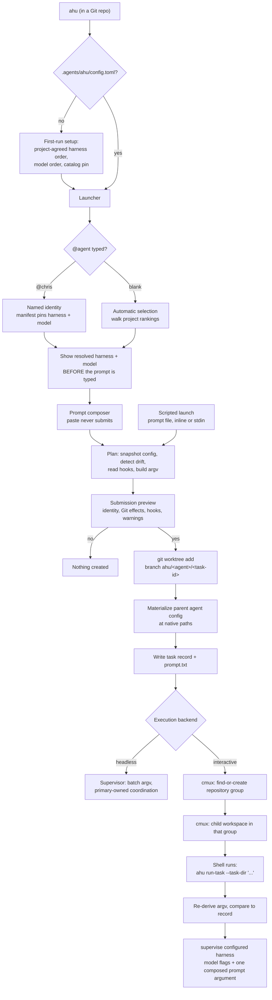
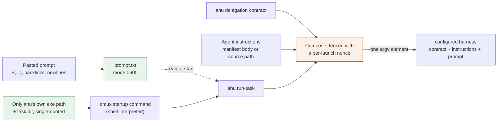
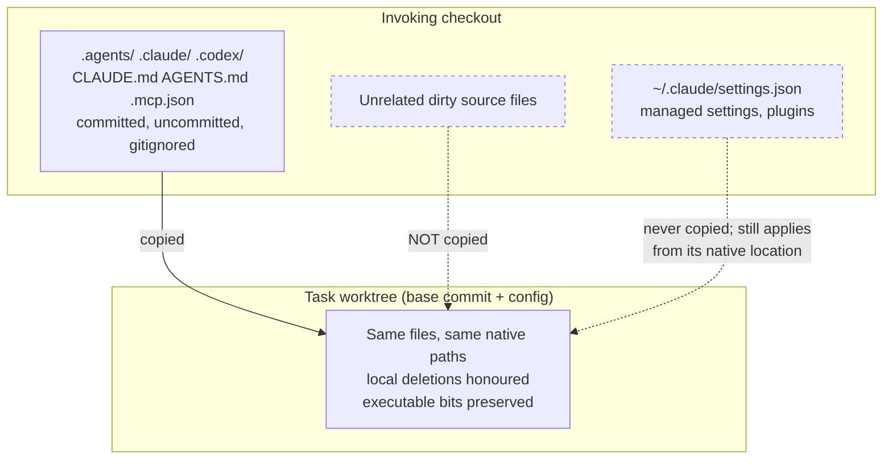
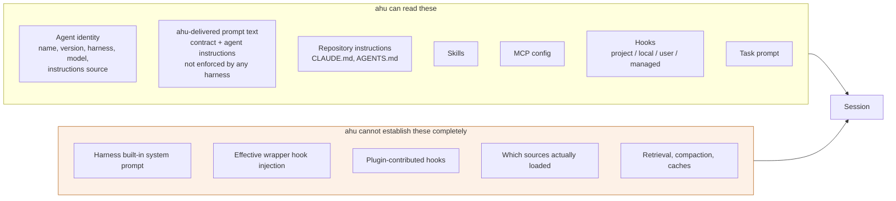

## What ahu is

ahu is cross-harness configuration management for agent sessions. It launches
agents that a repository defines into separate Git worktrees
and runs interactive sessions in cmux or unattended headless attempts.

ahu is not an agent harness. It does not host a model, run an agent loop, own a
conversation, or provide tools. Claude Code, Codex, the Antigravity CLI and OpenCode do
that. ahu decides which of them runs, with which model and instructions, in
which worktree, and reports visible context sources and coverage gaps.

An agent's harness, model, and instructions live in the repository, so changing
how it behaves is a reviewable change like any other. A launch uses exactly that
configuration or it fails.

## Delegation follows the entrypoint

Outside ahu, sub-agents and fan out use the current harness's native
sub-agent features. Inside ahu, registered assignments use registered ahu
agents, each using its configured harness and model in a separate worktree.
Headless children inherit that backend; interactive children use cmux.
Use ahu launch @name --prompt-file /path/to/task.txt.
Headless native helpers follow the frozen policy described below. Every
launch supplies its backend delegation contract as prompt text on every
harness, inside a fence tagged with a per-launch nonce,
ahead of the agent's instructions and then the task prompt. ahu uses no
system-prompt or agent-selection flag anywhere, so none of it is enforced;
the task prompt that follows can contradict it, and ahu cannot prevent a
harness or its shell tools from starting other processes.

## What ahu needs

- **cmux**, required for interactive task sessions; headless execution needs no cmux.
- **A supported harness**, installed and signed in by you: Claude Code, Codex, the Antigravity CLI, or OpenCode.
- **Git**: every task gets its own branch and worktree.

ahu creates the repository group and the per-task workspace through cmux, and
interactive sessions require that connection. Headless tasks and local inspection do
not. The harness is what actually runs the
agent; ahu never installs, configures, or authenticates one, and it does not
ship one. Sign-in is the harness's own, and ahu holds no API key for any of
them.
Git and default cmux lookup skip empty and relative PATH entries and use
canonical executables outside Git working trees. Candidate ancestry is
inspected without running candidate Git. Explicit AHU_CMUX_BIN retains
user-selected command semantics; these checks are not OS isolation.

ahu does not use an agent-selection or system-prompt flag. A native lookup
by name does not bind the selection to the file ahu read and digested.
Instructions travel in the prompt on all three harnesses, attributed to
their source file and delivered-text digest; delivery is not enforcement.

ahu holds no credentials and speaks to no model provider. Sign-in and the
approval boundary are the harness's own. Headless adapters pass explicit batch
controls; manifest-requested widening remains gated. ahu cannot assert the
effective boundary; harness settings also apply. The
launch preview reports what ahu read in them rather than asserting a result.

## Four rules everything else follows from

1. Fixed identity. A named agent's harness, model, and instructions are used
   as configured. No fallback model, no availability-based substitution, no
   task-driven prompt rewriting. Invalid configuration fails before a task starts.
   The harness and model are fixed by flags; the instructions are delivered as
   prompt text, which ahu reports as a gap rather than as enforcement.
2. One project policy. Rankings, cadence, and the fixed catalog revision are the same
   for every ahu user in the project. There are no personal profiles and no
   command-line switches that change them. A machine that cannot meet the policy
   reports a diagnostic; it does not get different behaviour.
3. Harness-native conventions win. Skills, memory, settings, and agent
   definitions stay where the harness wants them. ahu references them in place
   and never reorganises or rewrites them.
4. Say what you cannot do. Where ahu cannot see a context source or cannot
   enforce an identity, it reports that rather than implying a guarantee.

## Launch pipeline

## Identity and selection

Only `.agents/ahu/agents/<name>.md` makes an agent launchable. Definitions found
anywhere else are onboarding candidates, never implicit registrations: a skill is
not an agent, and AGENTS.md is not an agent registry. A manifest names an explicit
harness, an exact model identifier (never an alias), and a semantic version, and
either carries its instructions in its body or references a native definition in
place. A nonempty parsed frontmatter model other than inherit must match; ahu
does not rewrite either file.

At launch ahu reads that file, records two digests of it — one over the whole
file, one over exactly the instruction text it will deliver — and puts the
instruction text into the harness's prompt, ahead of the task prompt. It passes
no agent-selection flag on any harness. The harness and the model are fixed by
real flags; the identity is not, and ahu reports that as a gap rather than a
control.

Without an @agent, ahu walks the project's harness order, takes the first
with an available adapter and nonempty project model ranking, and selects
that ranking's first model. There is no catalog fallback or named identity. Local
prerequisites are checked after the pair is resolved, so a missing installation is
a diagnostic for that machine, never a different selection for that user.

## Prompt transport

The cmux startup command is shell-interpreted, so it contains only ahu's own
executable path and task directory, both single-quoted. The prompt is written to a
file and handed to the harness as one argument vector element. Shell syntax inside
a prompt is therefore delivered literally and never evaluated.

That one element holds everything ahu supplies, in a fixed order on every
harness: the delegation contract, available metadata and state, selected agent
instructions, then the request. Layout 3 fences each section with XML-shaped
tags carrying the launch nonce in both opening and closing names. Bodies retain
their exact bytes; this is raw text framing, not an escaped XML document.
Metadata and state hold frozen execution facts and native-session references,
without importing native history. Fence collisions refuse delivery; fences do
not enforce authority. Older records without a layout version replay layout 1
exactly; layout 2 keeps its frozen bytes. Unknown layouts refuse.

## Worktree inheritance

Every task gets a unique id, a fresh branch `ahu/<agent>/<task-id>`, and a fresh
worktree under .worktrees/ in the primary checkout. The worktree starts
at the invoking checkout's HEAD, then receives its recognized agent
configuration as it stands at submission — including uncommitted and Git-ignored
files, with local deletions honoured. Scan skips and depth limits bound coverage;
committed files under skipped paths still arrive through Git. Configuration
symlinks are not followed. Unrelated dirty source files stay behind.
Nothing is staged, committed, stashed, or reset in your checkout, ever.

## Context sources

`ahu inventory` marks each source loaded, available, disabled, opaque, or absent,
and ends with what ahu cannot see. `available` means the harness can discover a
source, not that its contents reached the model. The inventory is never labelled
complete.

## Hooks

Hooks run on harness lifecycle events and can affect tool calls or context.
ahu inventories Claude Code hook settings. Codex, Antigravity and OpenCode
launches report unknown hook coverage; a missing scan is not evidence of no
hooks. An OpenCode launch does name the plugin modules a repository declares.

Ordinary launch and inspection do not write hooks. Recognized configuration
travels into the task worktree with executable bits preserved; the harness
decides whether and when hooks run. Local settings can travel without being
shared policy. User and managed settings remain at their native locations.
Hooks outside project policy raise the consistency warning below.
ahu cmux status, doctor and launch disclosures share native integration evidence.
Registration, activation, isolation and live conformance are separate facts.
Explicit ahu cmux install --harness ID delegates fixed native installer argv;
--dry-run previews it. Native confirmations, scope and exit status are preserved.
The installer mapping is reviewed only for cmux 0.64.22 build ddd4a01bc.
Claude uses cmux Settings > Automation, with no native installer operation.
Reviewed OpenCode Feed lacks disable/surface guards and refuses headless use.
Unknown components and builds stay unknown. Static inspection is not live testing.

## Versions and drift

Every named agent carries a semantic version. ahu does not automate releases, but it
will not let a version label quietly cover changed inputs: if `chris@1.2.0` launches
with different instructions, repository configuration, policy, or hooks than the
last `chris@1.2.0` launch, that drift is reported as a pending behaviour change for
the next version bump. It is not classified as safe.

Drift names which digest moved. The instructions digest covers exactly the text ahu
delivered; the file digest covers the whole source file including any frontmatter.
An edit that changes only frontmatter moves the second and not the first, and drift
says so rather than reporting one number that could mean either.

## Headless attempts and results

launch --headless uses batch execution without cmux or a PTY. Add --background
to return after supervisor startup; otherwise execution stays in the foreground.
The preview names the admitted CLI profile, exact command, timeout and gaps.
Known cmux wrappers and unsupported versions fail without a fallback.
Minimal coordination belongs to the primary checkout's owner-only .ahu/state/.
Native event streams, stderr, final text and helper summaries are not copied.
New results use schema 2, with bounded outcome metadata and native references.
Unverified native locations remain unknown; references do not import history.
Native harness session stores keep their own external homes and retention.
tasks and task show backend, attempt, ownership and blockers; wait follows an attempt, result
reads its outcome and known native session with provenance and artifact locations.
Human inspection bounds and escapes metadata; process completion is not acceptance.
resume explicitly continues its recorded native session, and
cancel requests termination of the task and its recorded ahu descendants; an
interactive (cmux) task is stopped by its run-task parent. Confirmed cancellation
closes its workspace; an unconfirmed request leaves it open. Work and records stay.
Earlier attempt artifacts survive resume. Configuration or executable drift
refuses resume. A child cannot resume after its owning parent attempt terminates;
child/worker resume is also unsupported while its parent is live.
Legacy schema-1 resume and dispatch need the original runner or a new task.
Submit a new registered assignment with the prior result
and explicit source/revision scope; dirty changes and native sessions do not
transfer automatically. Child resume does not use the launch broker.
Supervisor loss is interrupted, with no automatic replay.
Process success and harness success are evidence, not orchestrator acceptance.
Reports and same-user editable records remain untrusted; provider-managed child
cleanup and child usage accounting can be unknown. Review actual work and tests.
Host submission grants registered children with --allow-child @name or
--allow-child-widened @name. Grants freeze identity and policy; descendants
cannot expand them. The supervisor broker dispatches the real registered child
outside the worker sandbox using the child's own harness and approval mapping.
Codex workspace-write gets a narrow request-directory write root; read-only
Codex broker transport is refused. Dead or stale parent attempts cannot admit
children. Failed or unjoined current-attempt children block parent success.
Limits: depth eight, 128 assignments per root grant, 16 active/interrupted
assignments per repository runtime store. No global token cap is promised.
Native helpers default to disabled. Bounded supports Claude Code 2.1.270 only:
the entire owner and helpers have read-only model tools, with no shell or edits.
The owner cannot shell-launch ahu children. A shell-capable coordinator instead
grants a separate registered bounded reviewer, which uses helpers internally.
Bounded uses one concurrent helper, depth one, the owner's exact model and a
USD 5 budget per attempt. Roles are requested; total helper count is not capped.
MCP and slash commands are excluded; settings and deny rules remain discoverable.
The model tool ceiling does not prove hooks cannot write or spawn processes.
Known successful helper joins are required. Provider-side cleanup stays unknown.
Codex 0.154.0/0.155.1, Antigravity 1.2.2 and OpenCode 1.18.29/1.18.30/1.18.31 admit ordinary
headless execution, but refuse bounded helpers. Claude 2.1.269 also admits only
the disabled profile.
Same-user code is not isolated from broker state. Hooks and arbitrary shell
commands require a vetted environment; ahu's backend itself does not use cmux.
Explicit cleanup removes recognized old captures and bounded requests, retaining
structured results, frozen inputs, native stores, branches and worktrees.

## State and records

Task worktrees are siblings under `.worktrees/` in the primary checkout.
An interactive task's record and prompt live in `.ahu/state/` in its worktree, chosen
by ahu at launch and passed to the session, so removing that worktree removes
them with it. `ahu tasks`, `task`, `diff` and `focus` find them by looking through
`.worktrees/`, from the primary checkout or from any sibling. The launch lock,
cmux group mapping, headless coordination and task index belong to the primary;
hygiene timestamps stay in the checkout they were recorded from. `.ahu/` ignores
itself in Git. Nested sessions discover state from their working checkout;
coordination stays in the primary checkout. Legacy lookup reads the primary and
invoking plain-checkout stores; managed worktree stores always enforce ownership.
Use ahu --repo PATH before the command to select a checkout explicitly.
AHU_REPO_ROOT, AHU_STATE_DIR, AHU_RUNTIME_DIR and AHU_TASK_INDEX_DIR are not selectors.
Old external stores are read in place; legacy-lookup.json names additional roots.
There is no migration or global task scope across unrelated repositories.
Task commands accept ahu:task:<id>, bare IDs and unique prefixes consistently.
Message arguments after the task reference are literal inbox payload.
The run-task owner supervises the child and lends/restores terminal foreground.
Cancellation uses live ownership, preserves work, and reports unconfirmed outcomes.
Terminal outcomes persist even if foreground restoration fails.
Existing state symlinks are refused; path checks and mutable record
digests do not protect against concurrent hostile host processes. Policy never lives
there. Each record freezes the launched
identity, digests, base commit, branch, worktree, and cmux ids, so editing an agent
later changes the next launch while a running task keeps what it started with.
Misplaced records in managed stores are reported as notes, not accepted or migrated.
After legacy lookup, recordless worktrees are reported as incomplete. Failed launch
rollback does not force-remove worktrees holding changes; it reports retained paths
and validates state paths before attempting cleanup. Listing never deletes them.

## What ahu will not do

- substitute a different harness or model, for any reason
- stage, commit, push, stash, reset, clean, or switch branches in your checkout
- silently add, edit, or remove hooks, or reorganise native skills, settings, or histories
- widen permissions unless a manifest asks for it, which the preview states in full before anything starts
- claim to know the effective approval boundary: the harness's own settings decide it, and ahu only reports what it read and which flags it passed
- install, configure, or authenticate a harness on your behalf
- delete a worktree, branch, or task record that may hold your work
- call an inventory complete, or a behaviour change harmless

## Standing warnings

ahu selects the configured harness and model at launch. During the session,
the harness manages model changes and its other native behavior. These are
normal harness capabilities, not launch problems.

> **ahu-supplied instructions are not enforced by the harness.**
>
> ahu delivers its delegation contract and the agent's instructions as
> prompt text, identically on every harness. It uses no agent-selection or
> system-prompt flag anywhere. A native agent lookup by name does not bind
> to the source file ahu read. The task prompt that follows can
> contradict any of it, and the model may follow the task prompt instead.
> What ahu does pin with real flags is the harness, the exact model, and
> the permission flags a manifest asks for.

> **Hooks configured outside this project are not project policy.**
>
> They can block tool calls and put text into the model's context, and they are
> not part of the configuration every ahu user in this project shares.

