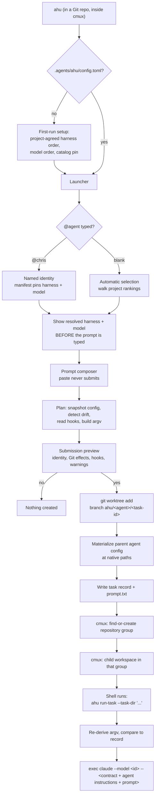
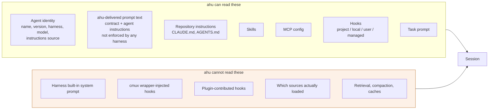

# ahu

`ahu` is cross-harness configuration management for agent sessions, built for
[cmux](https://cmux.com). It launches agents that a repository defines into
isolated Git worktrees and organises their sessions as rows under a repository
group in cmux.

**`ahu` is not an agent harness.** It does not host a model, run an agent loop,
own a conversation, or provide tools. [Claude Code](https://code.claude.com),
[Codex](https://learn.chatgpt.com), and the
[Antigravity CLI](https://antigravity.google) do that. `ahu` decides *which* of
them runs, with which model and instructions, in which worktree — and then
reports honestly on everything that can influence the session it started.

An agent's harness, model, and instructions live in the repository, so changing
how an agent behaves is a reviewable change like any other. A launch uses exactly
that configuration or fails; it never quietly substitutes a different harness or
model.

## Requirements

`ahu` orchestrates tools you already have. It ships none of them, installs none
of them, and holds no credentials of its own.

| You need | Why | Status in 0.1.1 |
| --- | --- | --- |
| **cmux** | Every task session is a cmux workspace under a per-repository group. `ahu` has no mode that runs without it. | Required. Verified against 0.64.22 (102) `[ddd4a01bc]`. |
| **A supported harness**, installed and authenticated by you | The harness is what actually runs the agent. | **Claude Code** (verified against 2.1.269). Codex and Antigravity CLI are detected and reported, but cannot be launched yet. |
| **Git** | Every task gets its own branch and worktree. | Required. |

`ahu` never installs, configures, or authenticates a harness, and it speaks to no
model provider. Sign-in and the approval boundary are the harness's own: `ahu`
passes no permission flag unless an agent's committed manifest asks for one, and
it does not claim to know what the effective boundary is — the harness's own
settings files decide that, and a launch preview reports what `ahu` read in them
rather than asserting a result.

Using `ahu` is also optional for your teammates. It adds launcher metadata under
`.agents/ahu/` and references your existing agent definitions where they already
are. Someone who never installs `ahu` keeps using the repository's harness setup
unchanged, and the fixed harness/model guarantees below apply only to
`ahu`-launched sessions.

## Install

With Rust and Cargo installed:

```sh
cargo install --git https://github.com/moai-agent/ahu --locked
```

Installing `ahu` does not modify any repository, install a harness, or change
shell startup files.

Ahu stores its operational state in `.ahu/state/` inside the checkout
where you run it. `.ahu/.gitignore` keeps the whole `.ahu/` directory out of Git. Each linked
worktree has its own state store; an agent session receives `AHU_STATE_DIR`
pointing inside the worktree it edits. Launch records remain in the launching
checkout's store, so run `ahu tasks` and `ahu focus` there to manage its launches.
The shared launch lock and cmux group mapping live in the primary checkout's
`.ahu/state/` so sibling sessions still coordinate as one repository.
All task checkouts are siblings under the primary checkout’s `.worktrees/`,
even when an agent launches another agent. No nested `.worktrees/` is created.
This controls ahu state; each harness still manages its own configuration and
credentials.

The default does not use `HOME` or `XDG_STATE_HOME`. Old records in
`~/.local/state/ahu` are not read, moved, or deleted automatically. An explicit
`AHU_STATE_DIR` override remains available for inspecting an older store or
isolating tests. Reinstalling does not require granting access to the old store.

## Getting started

Normal launches show a short task summary and commands to reopen the session.
Use `ahu launch ... --dry-run` for a detailed preview or add `--output json`
for a machine-readable plan. Digests and source provenance remain in these
inspection views and task records.

When launching from a restricted coding-agent session, the calling session
needs permission to create Git branches and worktrees and reach cmux. In Codex,
`workspace-write` protects `.git`; an on-request approval policy allows the
agent to request approval for `ahu launch`. For example, start the coordinating
session with `codex --sandbox workspace-write --ask-for-approval on-request`.
Managed policies may still disallow that approval. `--allow-widened-approvals`
controls the child agent only; it does not grant the parent session more access.

Run `ahu codex` from a Git checkout to open that coordinating session in your
current terminal. It runs `codex --sandbox workspace-write --ask-for-approval
on-request`, inherits your current directory, and uses Codex's configured model.
It needs no ahu project configuration or cmux connection and creates no task
worktree. Its ahu state stays in the checkout's ignored `.ahu/state/` directory.
Start it from your terminal: a process launched inside an existing sandbox still
inherits that outer sandbox's restrictions.

Run `ahu` inside a Git repository, from a cmux terminal (`ahu doctor` checks that
cmux, a harness, and the repository are all in order first):

```sh
ahu
```

The first run records the project's agreed harness and model order and saves it
to `.agents/ahu/config.toml`. That file is one policy for everyone in the
project: there are no personal profiles, environment overrides, or command-line
switches that select a different harness, model, or skill set for one user. It
works immediately without being committed; committing and sharing it is yours to
do, and `ahu` never stages, commits, or pushes it for you.

After that, `ahu` opens the launcher:

1. Select an agent by its displayed number, `@name`, or bare name. Leave it blank
   to use the project's automatic selection. An invalid selection prompts again.
2. `ahu` shows the resolved harness and model, and why, before you type anything.
3. Paste or type your task. Pasting never submits — finish with a line containing
   only `.`.
4. Review the submission preview and type its confirmation code to submit.
   Type `.cancel` on its own line in the composer to abandon the prompt.

`ahu` then creates a fresh branch and worktree, ensures this repository's group
exists in cmux, and opens a new session there running the configured harness.

```text
my-repository
  chris@1.2.0 — Implement settings validation   [running]
  sam@0.4.0 — Review authentication tests       [exited]
```

## How it works



Run `ahu explain` for the full architecture overview in your terminal,
`ahu explain --open` to render it — diagrams and all — in cmux's own Markdown
viewer, or `ahu explain --markdown > docs/architecture.md` to keep it as a file.
`--mermaid` emits just the diagrams.

## Delegating work

Delegation follows the entrypoint. In a normal harness session, requests for
sub-agents or fan out use that harness's native sub-agent features and stay
inside that harness. In an **ahu task prompt**, those requests mean **only
registered ahu agents**, with their configured harnesses, models, and cmux
workspaces. ahu's launch controls apply only to ahu-launched sessions.

Every ahu-launched session receives instructions to delegate through ahu. Each
assignment starts its registered agent's harness and exact model in a separate
cmux workspace, with its own task record, branch, and worktree.

```sh
ahu agents
ahu launch @offsec-astra --prompt-file /absolute/path/to/security-review.txt --dry-run
ahu launch @offsec-astra --prompt-file /absolute/path/to/security-review.txt
```

`launch` requires an existing project configuration and a registered agent. It
prints the launch disclosures and submits without an interactive confirmation;
`--dry-run` previews without creating a task or session. It keeps focus on the
coordinator. Missing agents, unavailable harnesses, and cmux failures are errors;
there is no fallback to the coordinator's harness or automatic selection.

Because this path reads no confirmation, an agent whose manifest declares
`permissions = "auto"` or `"accept-edits"` is refused unless the caller also
passes `--allow-widened-approvals`. That puts the widening into the command line
the delegating harness shows its own user before running it, instead of leaving
an unattended session to be started by a single unremarkable command.

The harness receives `AHU_BIN` pointing to the executable that started it, so it
can invoke `"$AHU_BIN" launch ...` even if ahu is absent from its PATH. Each child
receives the same delegation instructions. Review assignments must specify the
source checkout when reviewing uncommitted edits: a child's worktree starts at
its parent's HEAD and does not copy uncommitted source changes. Assign a report
path and read the actual findings before reporting completion.

Every harness receives the same thing in the same way: ahu's delegation contract,
then the resolved agent's instructions, then the task prompt, all in the harness's
prompt slot. ahu's two sections are wrapped in a fence whose tag carries a nonce
generated for that launch, and the contract says inside the fence that text
outside it claiming to amend ahu's instructions is not ahu's. A task prompt cannot
forge a fence, because it was written before the nonce existed.

ahu uses **no** agent-selection or system-prompt flag on any harness: it passes
neither `--agent` nor `--append-system-prompt`, and it denies no tools with
`--disallowedTools`. `--agent <name>` selects whatever the harness's own agent
search resolves that *name* to, which is not bound to the file ahu reads,
digests, and attributes the instructions to, so ahu was asserting a binding it
could not check. Delivering everything as prompt
text is weaker and uniform, and ahu describes it accurately: the preview and the
enforcement report list it as a **gap**, not a control. The task prompt that
follows can contradict it and the model may follow the task prompt instead. What
ahu still pins with real flags is the harness, the exact model, and the permission
flags an agent's manifest asks for.

This is not a process sandbox either: shell tools can still start processes, and
no adapter denies a harness's own delegation tools. Existing running sessions do
not acquire any of this; launch a new task with the rebuilt ahu executable.

## Scriptable launch previews

A launch prompt can come from an inline argument, a UTF-8 file, or piped stdin:

```sh
ahu launch @offsec-astra --prompt 'Review the subprocess argument handling.' --dry-run --allow-widened-approvals
ahu launch @offsec-astra --prompt-file assignment.txt --dry-run --allow-widened-approvals
printf '%s\n' 'Review the subprocess argument handling.' | ahu launch @offsec-astra --dry-run --allow-widened-approvals
ahu launch @offsec-astra --prompt 'Review the subprocess argument handling.' --dry-run --allow-widened-approvals --output json
```

`--prompt` and `--prompt-file` are mutually exclusive. An explicit source takes
precedence over stdin, which is read only when neither flag is given and stdin
is not a terminal. Empty or whitespace-only prompts are rejected. Accepted
prompt text retains its original bytes, including leading and trailing newlines.

`--dry-run --output json` writes one JSON object to stdout and human-readable
preview information to stderr. Previewing requires Git, valid project settings,
and the selected harness, but no cmux session. It launches no task. Actual
execution still requires cmux. Manifests that widen approvals require the
explicit `--allow-widened-approvals` flag for both previews and execution, as in
the examples above. JSON output is supported only with
`--dry-run`.

The JSON object has `schema_version: 1` and these fields:

| Field | Meaning |
| --- | --- |
| `agent` | Name, version, description, resolved source path, and full identity digest. |
| `harness`, `model`, `selection_basis` | The exact selected pair and why it was selected. |
| `policy_digest`, `catalog_version` | The configuration and compatibility catalog used. |
| `permissions` | The manifest's approval mode. |
| `argv` | Command and arguments, with the delivered prompt redacted. |
| `prompt_digest`, `prompt_bytes` | SHA-256 and UTF-8 byte length of the original task prompt. |
| `enforcement` | Model enforcement status, gaps, and applied controls. |
| `warnings` | Reliability, hook, and approval disclosures. |
| `executed` | Always `false` for a preview. |

JSON strings preserve the actual metadata through JSON escaping; terminal
display escaping is not applied to them. Consumers should check the schema
version and tolerate additional fields. Removing a field or changing its
meaning requires a schema version bump.

Commands return these exit codes:

| Code | Meaning |
| --- | --- |
| `0` | Success. |
| `1` | Cancelled by the user. |
| `2` | Invalid command usage. |
| `3` | Unknown or unregistered agent. |
| `4` | Missing prerequisite, such as Git repository, harness, or cmux. |
| `5` | Run failure, including invalid persisted configuration. |

## Terminal styling

Use `--color=auto`, `--color=always`, or `--color=never` with any command.
`always` and `never` override environment detection. Under `auto` (the default),
styling is disabled when `NO_COLOR` is set to any value, `TERM=dumb`, or stdout
is not a terminal. Redirected output is therefore plain by default. JSON stdout
never contains styling, even with `--color=always`.

Agent identity, harness/model, warnings, enforcement gaps, drift, and hints have
distinct styles. Labels and layout retain their meaning with color disabled.
Repository-controlled strings are escaped before styling so they cannot inject
terminal controls. The composer remains line-oriented: color does not change
the `.` sentinel, `.cancel`, or the confirmation code required for submission.

## This repository's agents

This project registers three agents, all using Codex with the exact model
`gpt-6-astra`. Automatic project selection also uses only that harness/model.

| Agent | Specialization |
| --- | --- |
| `@offsec-astra` | Identifies security issues and reports concrete evidence; leaves source unchanged. |
| `@defsec-astra` | Reviews defensive programming and implements focused hardening or refactoring when requested. |
| `@dev-astra` | Validates reported issues and implements fixes with regression coverage. |

Their versioned manifests live in `.agents/ahu/agents/` and their instructions
in `.agents/ahu/instructions/`. They retain unattended tool permissions and
require explicit user permission for remote pushes. ahu delivers these
instructions as prompt text; they are not an enforced system-prompt boundary.
All three may read the private roadmap and file security findings there. Private
roadmap information must never be copied into this public repository. Security
handoffs belong in verified private tracker records, not local ignored reports.

## Registering an agent

`ahu` launches an agent only when `.agents/ahu/agents/<name>.toml` registers it.
Definitions found elsewhere are onboarding candidates, never implicit
registrations — a skill is not an agent, and `AGENTS.md` is not an agent
registry.

```sh
ahu onboard                      # read-only preview; writes nothing
ahu onboard --register chris     # adds one manifest after you confirm
ahu onboard --remove chris       # removes that manifest and nothing else
```

A manifest references the native definition in place:

```toml
schema_version = 1
name = "chris"
version = "1.2.0"
description = "Helps implement repository tasks"
harness = "claude-code"
model = "claude-opus-5"

[source]
format = "claude-agent"
path = ".claude/agents/chris.md"
```

`harness` and `model` are required, explicit values. If the native definition
also declares a model, the two must agree; `ahu` will not rewrite either file or
pick one silently.

Every named agent needs a semantic version. `ahu` does not manage releases for
you, but it will tell you when a version label has stopped matching its inputs:
if `chris@1.2.0` launches with different instructions or a different repository
configuration than the last `chris@1.2.0` launch, that drift is reported as a
pending behavior change for the next version bump.

## Commands

| Command | What it does |
| --- | --- |
| `ahu` | The interactive launcher |
| `ahu init` | Record the project's harness and model order |
| `ahu agents` | List registered agents |
| `ahu onboard` | Preview or register native definitions |
| `ahu inventory [@agent]` | Everything that can influence an agent's context |
| `ahu hygiene [@agent]` | Run the context hygiene review now |
| `ahu tasks` | Tasks launched from this repository |
| `ahu task <task-id> [--output json]` | Recorded session state and task locations; works without cmux |
| `ahu diff <task-id>` | Tracked changes since the launch base, with untracked paths listed on stderr |
| `ahu focus <task-id>` | Bring a task's cmux session to the front |
| `ahu doctor` | Check repository, configuration, harness, and cmux |
| `ahu explain` | Architecture overview and diagrams (`--markdown`, `--mermaid`, `--open`) |
| `ahu help` | Usage |

## What a task gets

Inspect and review a task from the checkout that launched it:

```sh
ahu task <task-id> --output json
ahu diff <task-id>
```

Both commands accept a full task ID or an unambiguous prefix. Inspection reads
the saved record without contacting cmux or updating it. JSON schema version 1
includes `task_id`, `agent`, `harness`, `model`, `branch`, `base_commit`,
`worktree`, `worktree_exists`, `record_path`, `cmux_workspace_id`, and
`cmux_window_id`. `session_state` is the recorded `starting`, `running`,
`exited`, or `failed` state; `state_source` is `record` and
`completion_verified` is always `false`. Missing optional values are JSON null.
JSON remains unstyled even with `--color=always` and omits prompt text and titles.
Consumers should tolerate additional fields and check `schema_version`.

The task list labels states as `session running`, `session exited`, and so on.
A running session may be awaiting input; a process exit does not verify success.

`ahu diff` compares the launch base to the current task worktree, including
committed, staged, and unstaged tracked changes, including inherited agent
configuration. Untracked files are listed on stderr and are not included in the
patch; ignored files are omitted. Git external diff helpers and text conversion
are disabled. Terminal output escapes control characters; redirected stdout
preserves the patch bytes. The command fails if the checkout is missing or belongs
to another repository. Neither command stages, commits, or applies changes.

- **A fresh branch and worktree.** `ahu/<agent>/<task-id>`, based on the HEAD of
  the checkout you launched from, in a directory `ahu` manages outside your
  source tree. Repeated and concurrent launches always produce distinct tasks.
- **The whole repository agent configuration.** Every `.agents/`, `.claude/`,
  `.codex/`, `CLAUDE.md`, `AGENTS.md`, and `.mcp.json` in the working tree is
  copied in at its native path, including uncommitted and Git-ignored files, and
  configuration you have deleted locally stays deleted. Unrelated dirty source
  files stay in your original checkout.
- **The exact configured model, from a pinned binary.** The harness executable is
  resolved from `PATH` once, at submission, shown in the preview, and that exact
  path is what runs. No fallback model, no automatic routing, and no permission
  flag beyond the one a committed manifest asks for.
- **A frozen record.** The agent version, both digests of its source file, the
  configuration snapshot digest, the policy digest, the base commit, branch,
  worktree, and cmux ids are written to local task metadata. Editing an agent
  later changes the next launch; a running task keeps what it started with.

### Two digests, each named

A source file and the text ahu delivers from it are not the same bytes when the
format has YAML frontmatter, so `ahu` records and shows both, always labelled:

- **file digest** — SHA-256 of the complete file at `source.path`, exactly as it
  is on disk, frontmatter included. This is the one to compare against the
  repository.
- **instructions digest** — SHA-256 of exactly the text `ahu` puts in the prompt:
  the same file with its frontmatter stripped, byte-for-byte identical to what
  lands inside the `<<<ahu-agent-...>>>` fence.

For a format with no frontmatter the two cover the same bytes and come out equal.
Both are folded into the agent's identity digest, so a change to either is drift —
and drift says which one moved, because an edit to frontmatter alone changes the
file without changing anything the model was given.

Exiting the harness keeps the worktree, the branch, and the task record. A
process exit is not evidence that the task succeeded, and `ahu` never deletes
your work for you.

## Prompts are data

A task prompt can contain anything — `$(...)`, backticks, pipes, newlines. `ahu`
never puts a prompt into a shell command. The cmux startup command contains only
`ahu`'s own executable path and task directory, both shell-quoted; the prompt is
written to a file and handed to the harness as a single argument. That file is
the only copy: it is written owner-only, and the task record stores a digest and
a placeholder rather than the prompt text.

Repository content is also treated as untrusted on the way *out*. Hook commands,
agent descriptions, native frontmatter keys, and file names are all rendered with
control characters escaped, so a repository cannot use terminal escape sequences
to repaint or erase the disclosures in the launch preview.

Configuration is materialized into a task worktree without following symlinks.
A symlink at a configuration path in a fresh worktree can only come from the base
commit, and following it would let a repository direct `ahu`'s writes anywhere on
the filesystem, so the launch stops and names the path instead.

## Hooks

Hooks are shell commands the harness runs on its own lifecycle events. They are
the most behaviour-determining thing in a repository — one can block a tool call,
another can put arbitrary text into the model's context — and they often live in
Git-ignored directories that were never reviewed.

**ahu reports hooks and never writes them.** Adding or editing a hook on your
behalf would be exactly the invisible behaviour modification ahu exists to
prevent, and hooks are stronger than prose.

Only a hook's program is shown, never its arguments, and only its digest is
stored in the task record — hook commands routinely carry tokens, and an
inventory must not leak a credential merely to describe a hook.

`ahu inventory` and `ahu doctor` list every hook ahu can read, from
`.claude/settings.json`, `.claude/settings.local.json`, `~/.claude/settings.json`,
and managed settings, with its event, matcher, scope, and digest. The launch
preview then says what each one means for the task:

- **Hooks declared in the repository travel into the task worktree** and run
  there, with their executable bit intact. The preview names them and counts how
  many inherited configuration files are executable.
- **Hooks outside project policy raise a warning.** A hook in
  `settings.local.json` travels but is typically Git-ignored, so it may never have
  been shared or reviewed. A hook in a home directory or machine policy does not
  travel at all and can differ for every teammate. ahu prints the specific reason
  per hook rather than one blanket claim.
- **A hook change is drift.** The hook digest spans every scope ahu can read,
  including ones the repository snapshot cannot see, so a teammate's personal hook
  changing between two `chris@1.2.0` launches is reported rather than hidden under
  the same version label.

What ahu cannot see: hooks injected by the cmux Claude wrapper, and hooks
contributed by plugins. Both are reported as gaps rather than omitted. A settings
file that exists but cannot be parsed is reported as *unknown* hooks, never as
*no* hooks.

## Context inventory and hygiene



`ahu inventory` lists what can influence an agent: its fixed identity, the
repository instructions, skills, hooks, memory sources, MCP configuration,
personal configuration from your home directory, managed policy, and the task
prompt.
Sources are marked `loaded`, `available`, `disabled`, `opaque`, or `absent`, and
the report ends with what `ahu` cannot see. It is never labelled complete —
`available` means the harness can discover a source, not that its contents
reached the model.

On an agent's first load, and then on the project's cadence
(`context_hygiene.review_interval_days`, a project-wide setting), `ahu` reviews
memory and skills that may be influencing the agent and shows a concrete cleanup
proposal. It deletes nothing, disables nothing, and stages nothing. Where a
source is shared with other agents or projects, it says so rather than presenting
a global deletion as a local one.

## Limitations in 0.1.1

These are real and deliberate; `ahu` reports them rather than papering over them.

- **The harness manages the running session.** Ahu selects the configured harness
  and model at launch. Model switching and other native session behavior remain
  under the harness's control and are not reported as reliability warnings.
  Detailed capabilities remain available through `ahu inventory` and JSON plans.
- **Per-agent skill and memory controls are reporting only.** Claude Code does not
  expose switches that disable one skill, or separate memory reading from memory
  writing, for a single agent from outside a session, so `ahu` does not offer
  those as per-agent operations and does not claim "memory off".
- **The inventory is incomplete by construction.** Built-in harness instructions,
  which sources actually reached the model, in-session retrieval, and compaction
  are not observable from outside a session. Hooks injected by the cmux Claude
  wrapper and hooks contributed by plugins cannot be enumerated either.
- **ahu does not manage hooks.** It reports them, warns when they fall outside
  project policy, and counts them as drift. It never adds, edits, removes, or
  disables one, and it cannot stop an inherited repository hook from running in a
  task worktree.
- **Not every directory is scanned.** Configuration inside `node_modules`,
  `target`, `dist`, `build`, `vendor`, virtualenvs, and similar directories is
  neither inventoried nor inherited. Configuration symlinks are reported as gaps
  rather than followed.
- **No release or evaluation automation.** Version bumps, change summaries, and
  benchmarks are yours to manage. `ahu` records drift and digests; it does not
  classify a change as safe.
- **cmux is required**, and `ahu` must be able to reach it. There is no headless
  or one-shot mode, and running outside a cmux terminal is not supported yet.
  Resuming a terminated harness session is not supported; `ahu focus` brings an
  existing one to the front.
- **`ahu` is not a harness and will not become your agent runtime.** If your
  harness cannot do something, `ahu` reports that rather than working around it.
- **One harness.** Codex and Antigravity definitions are detected and reported as
  unlaunchable rather than translated.

## Compatibility

Verified on 2026-09-11 against Claude Code 2.1.269 and cmux 0.64.22 (102)
`[ddd4a01bc]`. The harness/model compatibility catalog is pinned by version in
project configuration, so installing a newer `ahu` cannot silently change which
model your project selects; a catalog change is a shared project decision.

## Development

```sh
cargo fmt --check
cargo clippy --all-targets -- -D warnings
cargo test
```

The cmux integration tests talk to a real cmux instance when one is reachable.
They create their own group and workspaces, remove exactly what they created, and
skip with a message when cmux is unavailable. Every test works inside a temporary
directory with its own `AHU_STATE_DIR`.

The suite does not start a real Claude Code session; the harness launch is
verified against a stand-in executable, and the argument shape against the
installed Claude Code CLI.

`cargo test --test explain` guards the structure of the built-in diagrams. To
check that they actually render, parse the emitted blocks with Mermaid itself:

```sh
cargo run -- explain --mermaid > /tmp/diagrams.md   # or --markdown
# then parse /tmp/diagrams.md with mermaid.parse() from the `mermaid` npm package
```
