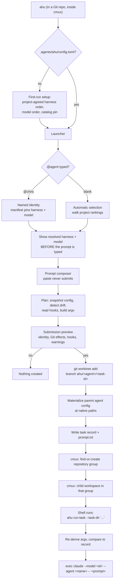
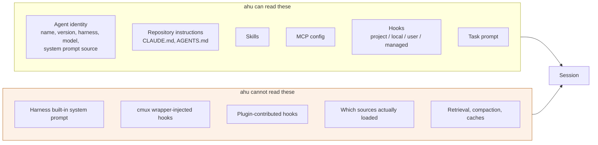

# ahu

`ahu` launches repository-defined agents in isolated Git worktrees and organises
their interactive sessions in [cmux](https://cmux.com).

An agent's harness, model, and instructions live in the repository, so changing
how an agent behaves is a reviewable change like any other. A launch uses exactly
that configuration or fails; it never quietly substitutes a different harness or
model.

Using `ahu` is optional. It adds launcher metadata under `.agents/ahu/` and
references your existing agent definitions where they already are. A teammate who
never installs `ahu` keeps using the repository's harness setup unchanged, and
the fixed harness/model guarantees below apply only to `ahu`-launched sessions.

**Version 0.1.1 supports Claude Code.** Codex and Antigravity CLI definitions are
recognised and reported, but cannot be launched yet.

## Install

With Rust and Cargo installed:

```sh
cargo install --git https://github.com/moai-agent/ahu --locked
```

Installing `ahu` does not modify any repository, install a harness, or change
shell startup files.

## Getting started

Run `ahu` inside a Git repository, from a cmux terminal:

```sh
ahu
```

The first run records the project's agreed harness and model order and saves it
to `.agents/ahu/config.toml`. That file is one policy for everyone in the
project: there are no personal profiles, environment overrides, or command-line
switches that select a different harness, model, or skill set for one user. It
works immediately without being committed; committing and sharing it is yours to
do, and `ahu` never stages, commits, or pushes it for you.

After that, `ahu` opens the launcher:

1. Optionally type `@chris` to select a named agent. Leave it blank to use the
   project's automatic selection.
2. `ahu` shows the resolved harness and model, and why, before you type anything.
3. Paste or type your task. Pasting never submits — finish with a line containing
   only `.`.
4. Review the submission preview and confirm.

`ahu` then creates a fresh branch and worktree, ensures this repository's group
exists in cmux, and opens a new session there running the configured harness.

```text
my-repository
  chris@1.2.0 — Implement settings validation   [running]
  sam@0.4.0 — Review authentication tests       [exited]
```

## How it works



Run `ahu explain` for the full architecture overview in your terminal, or
`ahu explain --mermaid > docs/architecture.md` for the diagrams alone.

## Registering an agent

`ahu` launches an agent only when `.agents/ahu/agents/<name>.toml` registers it.
Definitions found elsewhere are onboarding candidates, never implicit
registrations — a skill is not an agent, and `AGENTS.md` is not an agent
registry.

```sh
ahu onboard                      # read-only preview; writes nothing
ahu onboard --register chris     # adds one manifest after you confirm
ahu onboard --remove chris       # removes that manifest and nothing else
```

A manifest references the native definition in place:

```toml
schema_version = 1
name = "chris"
version = "1.2.0"
description = "Helps implement repository tasks"
harness = "claude-code"
model = "claude-opus-5"

[source]
format = "claude-agent"
path = ".claude/agents/chris.md"
```

`harness` and `model` are required, explicit values. If the native definition
also declares a model, the two must agree; `ahu` will not rewrite either file or
pick one silently.

Every named agent needs a semantic version. `ahu` does not manage releases for
you, but it will tell you when a version label has stopped matching its inputs:
if `chris@1.2.0` launches with different instructions or a different repository
configuration than the last `chris@1.2.0` launch, that drift is reported as a
pending behavior change for the next version bump.

## Commands

| Command | What it does |
| --- | --- |
| `ahu` | The interactive launcher |
| `ahu init` | Record the project's harness and model order |
| `ahu agents` | List registered agents |
| `ahu onboard` | Preview or register native definitions |
| `ahu inventory [@agent]` | Everything that can influence an agent's context |
| `ahu hygiene [@agent]` | Run the context hygiene review now |
| `ahu tasks` | Tasks launched from this repository |
| `ahu focus <task-id>` | Bring a task's cmux session to the front |
| `ahu doctor` | Check repository, configuration, harness, and cmux |
| `ahu explain` | Architecture overview and Mermaid diagrams (`--mermaid` for just the diagrams) |
| `ahu help` | Usage |

## What a task gets

- **A fresh branch and worktree.** `ahu/<agent>/<task-id>`, based on the HEAD of
  the checkout you launched from, in a directory `ahu` manages outside your
  source tree. Repeated and concurrent launches always produce distinct tasks.
- **The whole repository agent configuration.** Every `.agents/`, `.claude/`,
  `.codex/`, `CLAUDE.md`, `AGENTS.md`, and `.mcp.json` in the working tree is
  copied in at its native path, including uncommitted and Git-ignored files, and
  configuration you have deleted locally stays deleted. Unrelated dirty source
  files stay in your original checkout.
- **The exact configured model.** No fallback model, no automatic routing, and no
  change to the harness's own permission and approval boundaries.
- **A frozen record.** The agent version, instruction digest, configuration
  snapshot digest, policy digest, base commit, branch, worktree, and cmux ids are
  written to local task metadata. Editing an agent later changes the next launch;
  a running task keeps what it started with.

Exiting the harness keeps the worktree, the branch, and the task record. A
process exit is not evidence that the task succeeded, and `ahu` never deletes
your work for you.

## Prompts are data

A task prompt can contain anything — `$(...)`, backticks, pipes, newlines. `ahu`
never puts a prompt into a shell command. The cmux startup command contains only
`ahu`'s own executable path and task directory, both shell-quoted; the prompt is
written to a file and handed to the harness as a single argument.

## Hooks

Hooks are shell commands the harness runs on its own lifecycle events. They are
the most behaviour-determining thing in a repository — one can block a tool call,
another can put arbitrary text into the model's context — and they often live in
Git-ignored directories that were never reviewed.

**ahu reports hooks and never writes them.** Adding or editing a hook on your
behalf would be exactly the invisible behaviour modification ahu exists to
prevent, and hooks are stronger than prose.

`ahu inventory` and `ahu doctor` list every hook ahu can read, from
`.claude/settings.json`, `.claude/settings.local.json`, `~/.claude/settings.json`,
and managed settings, with its event, matcher, scope, and digest. The launch
preview then says what each one means for the task:

- **Hooks declared in the repository travel into the task worktree** and run
  there, with their executable bit intact. The preview names them and counts how
  many inherited configuration files are executable.
- **Hooks outside project policy raise a warning.** A hook in
  `settings.local.json` travels but is typically Git-ignored, so it may never have
  been shared or reviewed. A hook in a home directory or machine policy does not
  travel at all and can differ for every teammate. ahu prints the specific reason
  per hook rather than one blanket claim.
- **A hook change is drift.** The hook digest spans every scope ahu can read,
  including ones the repository snapshot cannot see, so a teammate's personal hook
  changing between two `chris@1.2.0` launches is reported rather than hidden under
  the same version label.

What ahu cannot see: hooks injected by the cmux Claude wrapper, and hooks
contributed by plugins. Both are reported as gaps rather than omitted. A settings
file that exists but cannot be parsed is reported as *unknown* hooks, never as
*no* hooks.

## Context inventory and hygiene



`ahu inventory` lists what can influence an agent: its fixed identity, the
repository instructions, skills, hooks, memory sources, MCP configuration,
personal configuration from your home directory, managed policy, and the task
prompt.
Sources are marked `loaded`, `available`, `disabled`, `opaque`, or `absent`, and
the report ends with what `ahu` cannot see. It is never labelled complete —
`available` means the harness can discover a source, not that its contents
reached the model.

On an agent's first load, and then on the project's cadence
(`context_hygiene.review_interval_days`, a project-wide setting), `ahu` reviews
memory and skills that may be influencing the agent and shows a concrete cleanup
proposal. It deletes nothing, disables nothing, and stages nothing. Where a
source is shared with other agents or projects, it says so rather than presenting
a global deletion as a local one.

## Limitations in 0.1.1

These are real and deliberate; `ahu` reports them rather than papering over them.

- **Claude Code cannot hold a model for a whole session.** `--model` pins the
  model at launch, but an interactive session can change it with `/model`, and
  `ahu` has no supported control that prevents that. Every Claude Code launch
  therefore carries the warning *"This harness is not reliable for producing
  consistent personified agent behavior"*, in the preview, in the session, and in
  the task record. `ahu` still always requests the configured identity and never
  substitutes another.
- **Per-agent skill and memory controls are reporting only.** Claude Code does not
  expose switches that disable one skill, or separate memory reading from memory
  writing, for a single agent from outside a session, so `ahu` does not offer
  those as per-agent operations and does not claim "memory off".
- **The inventory is incomplete by construction.** Built-in harness instructions,
  which sources actually reached the model, in-session retrieval, and compaction
  are not observable from outside a session. Hooks injected by the cmux Claude
  wrapper and hooks contributed by plugins cannot be enumerated either.
- **ahu does not manage hooks.** It reports them, warns when they fall outside
  project policy, and counts them as drift. It never adds, edits, removes, or
  disables one, and it cannot stop an inherited repository hook from running in a
  task worktree.
- **Not every directory is scanned.** Configuration inside `node_modules`,
  `target`, `dist`, `build`, `vendor`, virtualenvs, and similar directories is
  neither inventoried nor inherited. Configuration symlinks are reported as gaps
  rather than followed.
- **No release or evaluation automation.** Version bumps, change summaries, and
  benchmarks are yours to manage. `ahu` records drift and digests; it does not
  classify a change as safe.
- **cmux is required**, and `ahu` must be able to reach it. Running outside a cmux
  terminal is not supported yet. Resuming a terminated harness session is not
  supported; `ahu focus` brings an existing one to the front.
- **One harness.** Codex and Antigravity definitions are detected and reported as
  unlaunchable rather than translated.

## Compatibility

Verified on 2026-09-11 against Claude Code 2.1.269 and cmux 0.64.22 (102)
`[ddd4a01bc]`. The harness/model compatibility catalog is pinned by version in
project configuration, so installing a newer `ahu` cannot silently change which
model your project selects; a catalog change is a shared project decision.

## Development

```sh
cargo fmt --check
cargo clippy --all-targets -- -D warnings
cargo test
```

The cmux integration tests talk to a real cmux instance when one is reachable.
They create their own group and workspaces, remove exactly what they created, and
skip with a message when cmux is unavailable. Every test works inside a temporary
directory with its own `AHU_STATE_DIR`.

The suite does not start a real Claude Code session; the harness launch is
verified against a stand-in executable, and the argument shape against the
installed Claude Code CLI.

`cargo test --test explain` guards the structure of the built-in diagrams. To
check that they actually render, parse the emitted blocks with Mermaid itself:

```sh
cargo run -- explain --mermaid > /tmp/diagrams.md
# then parse /tmp/diagrams.md with mermaid.parse() from the `mermaid` npm package
```
