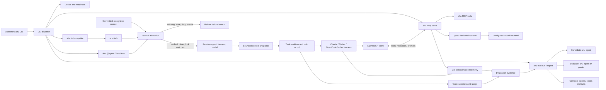

# ahu system architecture

This diagram follows the main paths through the CLI. Agent behavior occurs in a
provider harness; ahu prepares and records the session, while the MCP server
exposes ahu tools to connected agents. Telemetry and task records provide
complementary evidence for evaluation. Neither proves that the harness loaded
all context or followed every instruction.[^main][^launch][^mcp][^telemetry][^eval]

## Reading the boundaries

`ahu.lock` gates use of recognized project context. `ahu lock --update` writes a
candidate lock; an operator reviews and commits it with the context files. The
lock does not contain per-user settings. Recognized local settings that affect
agent behavior are separately fingerprinted in owner-only host state per user
and repository; changing them requires that user to accept the new fingerprint.
Neither lock covers managed provider policy, built-in harness prompts, or
context the bounded scan cannot identify.[^lock][^launch]

The CLI launches provider harnesses and hosts ahu's MCP server as separate
interfaces. A harness can call MCP tools while it works. The typed decision
interface validates structured requests and can route them to a configured
service; it is independent of the candidate agent's harness model.[^mcp][^decisions]

OTel records bounded process and tool-call evidence when telemetry is enabled.
Task records capture ahu-known lifecycle and outcome details. The eval runner
joins available evidence with case expectations and evaluator scores. Missing
spans mean unknown coverage; they do not mean the agent did not use a tool. Human
review of traces and cases is still needed when changing instructions, skills,
or tools.[^telemetry][^eval][^eval-run][^state]

Local auth profiles opt the project into identity checks before launch/startup
and resume. Tasks record the profile and identity fingerprint. Resume compares
both with the active binding and observed native login; changing the binding
does not migrate a task. Without profiles, this guard is inactive. Readiness
reports identity/binding states without principals or credentials. These checks
are best effort, not an atomic credential lock: sign-in can change after a
probe. OpenCode cloud-model checks assume the model uses the loopback Ollama
daemon selected by `OLLAMA_HOST`; they do not verify OpenCode's effective
provider endpoint.[^auth]

The task-bound `ahu_request_approval` MCP tool records a cooperative checkpoint
and waits for `ahu approve TASK` or `ahu reject TASK`. Rejection or expiry
requests cancellation. The checkpoint does not intercept arbitrary tool calls,
shell commands, or filesystem writes, and does not expand native harness
permissions.[^approval]

[^main]: CLI routing in src/main.rs.
[^launch]: Launch admission and task planning in src/launch.rs.
[^lock]: Lock generation and checks in src/context_lock.rs.
[^mcp]: MCP registration and protocol handling in `src/mcp.rs`.
[^decisions]: Typed decision validation in src/mcp_decisions.rs.
[^telemetry]: Instrumentation in src/telemetry.rs.
[^eval]: Evaluation CLI in src/eval.rs.
[^eval-run]: Trial orchestration in src/eval.rs.
[^state]: Task records in src/task.rs.
[^auth]: Profile, readiness, launch, and resume checks in src/auth_binding.rs.
[^approval]: Explicit request and operator decision lifecycle in src/approval.rs.
