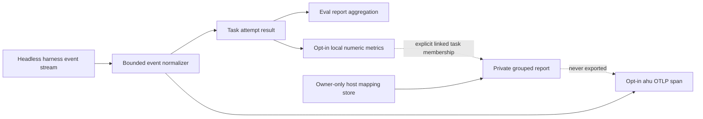

# Telemetry evidence and privacy boundaries

ahu records observations from harness event streams. An observed token count is
not a price; a harness-reported USD amount is not a provider invoice; an absent
quota field is not evidence of remaining capacity. Reports preserve those
distinctions and leave unavailable values missing.[^headless][^eval]

## Collection path

Token fields are normalized from the harness stream when present. Claude Code's
result `total_cost_usd` and OpenCode's observed step costs are recorded as
`ahu.cost.harness_reported_usd`, with a bounded source label. OpenCode step
events are deduplicated by part ID. The cost field does not claim final billing,
and ahu does not derive cost from token counts or catalog prices. Codex and
Antigravity currently provide no documented per-run USD field to this adapter.
The user reference describes the current source and scope for each harness.[^headless]

`local_metrics` is opt-in and does not require an OTLP collector. Schema version
2 contains the normalized token fields, elapsed process duration, and an
observed/unavailable USD field. An observed zero is distinct from an unavailable
value. Per-attempt token
snapshots use the maximum reported value for each field; that rule does not
claim an additive task total. Eval reports keep USD fields separate from token
means and show observation counts against group run counts.[^telemetry][^eval]

## Data classification

| Data | Local task result | OTLP span | Private mapping summary |
| --- | --- | --- | --- |
| Task, harness, model identity | Existing bounded result metadata | Allowlisted identity attributes | Caller supplies repository digest and task UUIDs |
| Token usage and harness-reported USD | Numeric observation with provenance | Numeric attributes, plus a bounded cost source label | Numeric-only summary; no inferred cost |
| Opaque local record key | Host-private mapping only | Not accepted as an OTLP attribute | Excluded from numeric summary |
| Tracker title, address, or body | Not read or stored | Not accepted as an OTLP attribute | Not accepted |
| Prompt, transcript, tool arguments, credentials, account history | Excluded from normalized metrics | Excluded from ahu's normalized spans | Not accepted by the summary input |

The telemetry endpoint is restricted to a local collector. A local collector
may have its own exporters and retention; ahu cannot establish those policies.
The opaque mapping key and tracker content must not be added to resource
attributes, task records, prompts, public reports, or committed repository
files. The private mapping type intentionally lacks `Debug` and `Serialize`. Its summary
contains a validated repository digest and optional agent digest with harness,
model, and outcome labels so reports can group comparable runs. It also reports
timing coverage, per-field maximum token observations, and mean harness-reported
cost by source. It does not pool observations across different groups or cost
sources, and does not include the mapping key, task IDs, or paths.[^telemetry][^private]

## Private association lifecycle

`ahu telemetry link|unlink` maintains explicit task membership under the user's
owner-only host state directory, outside all checkouts. The key is an opaque
local string and ahu does not contact a tracker or verify its visibility. The
mapping store is schema-versioned, bounded, symlink-resistant, locked during
updates, and atomically written. It accepts validated task references only;
task records, prompts, configuration, MCP, and OTLP never receive the key.[^private]

Retries and resumes retain a task UUID and are distinguished by attempt number.
Identical duplicate observations for an attempt count once; conflicting values
for the same task and attempt fail the summary. A child task must be explicitly
included in the mapping. Merging a worktree does not change its task UUID.
`ahu remove` leaves the mapping intact; reports show missing task records, and
`ahu telemetry unlink` removes one task or the whole mapping explicitly.
Mappings are not synchronized between machines and do not expire automatically.
No automatic traversal of related task directories occurs.[^private]

## Threat boundaries and gaps

The parser rejects unknown fields, caps input size and task/observation counts,
validates canonical identifiers, and returns a fixed redacted error. Its
numeric summary does not emit task IDs, repository paths, arbitrary attributes,
or the private record key. This prevents accidental disclosure through this
library API; it does not authenticate a mapping, prove tracker visibility, or
make an insecure host store safe.[^private]

`ahu telemetry report` reads only result envelopes with validated task ownership
and extracts opted-in numeric projections. It groups by agent identity,
harness, model, and outcome, and shows timing, per-field token observations,
coverage, and source-separated harness cost. Attempts without local metric
projections remain unavailable in their groups. ahu has no automatic quota
query, final billing API, interactive-session usage reader, tracker client, or
automatic issue visibility check. Every report explicitly shows capacity as
unknown because no trusted per-run or account capacity signal is collected.
Each group separately counts complete, incomplete, and unknown native-event
evidence so process exit status is not mistaken for a complete harness stream.
Offline fixtures verify adapter behavior; they do not prove live provider
billing or quota.

[^headless]: `src/headless.rs` normalizes bounded harness events and persists attempt results.
[^eval]: `src/eval.rs` aggregates observed values and renders eval comparisons.
[^telemetry]: `src/telemetry.rs` configures local-only opt-in OTLP and local metrics.
[^private]: `src/telemetry/private.rs` validates the private mapping and numeric summary input.
